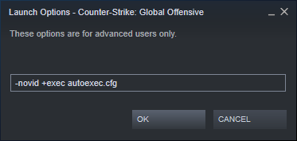

# config scripts  
In the next we assume steam was installed on C: root drive

## utterly indispensable
* autoexec

You should create an autoexec file named `autoexec.cfg` (or `whateveryouwant.cfg`) in
`C:\Steam\steamapps\common\Counter-Strike Global Offensive\csgo\cfg`. Then in game type `exec autoexec` (without the `.cfg` extension) to execute it and update your current config.
Or add it to the launch option `+exec autoexec.cfg` (with extension) to load it automatically each time you start the game.   
  
Here is my updated custom script file if you want to check : 
https://github.com/fpapouin/tntpro/blob/master/cfg/0pohhop.cfg  

Inside your empty file you can add thoses scripts

* soundToggle on L key to lower game sound during warmup for example (set your prefered volume number in script)
```
    //soundToggle
    alias soundToggle soundToggle1
    alias soundToggle1 "volume 0.25;alias soundToggle soundToggle2"
    alias soundToggle2 "volume 0.025;alias soundToggle soundToggle1"
    alias st soundToggle
    bind l st
```

* voiceToggle on H key to lower russians voices while clutch (change your prefered scale number in script)
```
    //voiceToggle
    alias voiceToggle voiceOff
    alias voiceOn "voice_scale 0.25;alias voiceToggle voiceOff"
    alias voiceOff "voice_scale 0.015;alias voiceToggle voiceOn"
    bind h voiceToggle
```

* demo control for overwatch session (slow, fast, faster, pause, end) (no need shift+F2 with invisible mouse cursor anymore)
```
    bind "KP_LEFTARROW" "+num_4"
    bind "KP_5" "+num_5"
    bind "KP_RIGHTARROW" "+num_6"
    bind "KP_UPARROW" "num_8"
    bind "KP_PGUP" "num_9"
    alias +num_4 "demo_timescale 0.25"
    alias -num_4 "demo_timescale 1"
    alias +num_5 "demo_timescale 4"
    alias -num_5 "demo_timescale 1"
    alias +num_6 "demo_timescale 8"
    alias -num_6 "demo_timescale 1"
    alias num_8 "demo_gototick 200000"
    alias num_9 "demo_togglepause"
```

* jumpthrow for perfect grenades and win more rounds
```
    bind "KP_ENTER" "+jump;-attack;-jump"
    //or
    bind "MOUSE3" "+mouse3"
    alias +mouse3 "+jump; -attack;"
    alias -mouse3 "-jump"
```

* type `sf` in console during freezetime to fix server fps bug drop 2020
```
    alias sf "record 1;stop"
```

## gameplay
* console filter to highligh dammage given and taken in console
```
    con_filter_text Damage
    con_filter_text_out Player:
    con_filter_enable 2
```

* cleardecal to remove blood and bullet holes for better vision (I manually push the capslock key because sometimes seeing blood is important)
```
    bind "CAPSLOCK" "r_cleardecals"
```

* unknown radio command (needrop and sorry got sound for agents)
```
    bind "KP_INS" "num_0"
    bind "KP_END" "num_1"
    bind "KP_DOWNARROW" "num_2"
    bind "KP_PGDN" "num_3"
    alias num_0 needrop
    alias num_1 go_a
    alias num_2 go_b
    alias num_3 sorry
```

* rewrite default cvar
```
    r_drawtracers_firstperson 1
    cl_disablefreezecam 1 // for casual
    cl_autowepswitch 0
    spec_replay_autostart 0 // for casual
    cl_invites_only_friends 1
    cl_join_advertise 2 // allow friends to join live custom match
    gameinstructor_enable 0 // remove info for new players
    cl_autohelp 0 // remove info for new players
    cl_showhelp 0 // remove info for new players
    cl_disablehtmlmotd 1 // remove info for new players
    cl_showloadout 1 // always show inventory without the need to switch
    cl_teamid_overhead_mode 2 // show team weapons whole round
    net_graph 1 // show fps and ping
    cl_filtertext_enabled 0 // disable bad words filter
```

* sound and music
```
    volume 0.025 // game volume reset at game start 
    voice_scale 0.25 // other player microphone volume reset at game start 
    snd_menumusic_volume 0.01
    snd_deathcamera_volume 0.01 // each time you die, very stressfull
    snd_mapobjective_volume 0.05
    snd_roundend_volume 0.05
    snd_roundstart_volume 0.05
    snd_mvp_volume 0.05
    snd_dzmusic_volume 0.05
    snd_tensecondwarning_volume 0.05 // you can put previous music volume to 0 but not this one because it is usefull to know when you have time to defuse the bomb
```

* radar footstep range (like in valorant) (I currently don't use it)
```
    cl_radar_always_centered 1
    cl_radar_scale 0.85
```

* toggle all radio and text radio (usefull when muted toxic player continue to spam radio)
```
    bind "PGUP" ignorerad
```

## usefull
### config.cfg with multiple accounts
Open `C:\Steam\logs\connection_log.txt` and find a the end of the file a line like `[2020-09-01 13:15:17] [1,3] RecvMsgClientLogOnResponse() : [U:1:88924] 'OK'`. `88924` is your userdata ID.
Copy `C:\Steam\userdata\88924\730\local\cfg\config.cfg` to `C:\Steam\steamapps\common\Counter-Strike Global Offensive\csgo\cfg\config.cfg`. Then the next times you start csgo on a new steam account, the config.cfg will be loaded.

### voice_loopback
While ingame (I suggest you test this with bots) `voice_loopback 1` you can hear you own microphone voice and configure windows settings to make it better (activate noise suppression, beam forming, acoustic echo cancellation...)

### server config
* for lan
```
    mp_autokick 0
    mp_halftime_duration 1
    mp_match_end_restart 1
    sv_gameinstructor_disable 1
    sv_pausable 0
    mp_autoteambalance 0
    mp_limitteams 0
    mp_freezetime 0
    sv_party_mode 1
    sv_alltalk 1
    sv_full_alltalk 1
```

* for competition (in completion with the previous commands)
```
    mp_freezetime 15
    mp_consecutive_loss_aversion 0 // old eco
    mp_starting_losses 0 // old eco
    bot_kick
    mp_warmup_end
    mp_restartgame 1
```

* disable time limit for tests
```
    mp_roundtime 60
    mp_roundtime_defuse 0
    mp_roundtime_hostage 0
    mp_warmuptime 999999
    mp_maxrounds 150
```

* for kz maps
```
    mp_solid_teammates 2
    bot_kick
    mp_warmup_end
    sv_airaccelerate 100
    mp_restartgame 1
```

* to auto relive after warmup
```
    mp_respawn_on_death_t 1
    mp_respawn_on_death_ct 1
```

* cheats
```
    sv_cheats 1
    mp_radar_showall 1
    weapon_accuracy_nospread 1
    weapon_recoil_scale 0
    weapon_recoil_view_punch_extra 0
    sv_infinite_ammo 1
    impulse 101
    sv_occlude_players 0
    pvs_min_player_distance 9999
    sv_autobunnyhopping 1
    sv_enablebunnyhopping 1
    god // switch you to god or normal
    gods // reverse godmode for all players and bots currently connected
```

* training grenades with noclip
```
    sv_grenade_trajectory 1
    sv_showimpacts 1
    cl_grenadepreview 1
    bind ALT +noclip
    alias +noclip "noclip;+forward"
    alias -noclip "noclip;-forward"
    sv_cheats 1
    sv_infinite_ammo 1
    mp_solid_teammates 2
```

* here my current script for fast console alias
```
    alias lan "mp_autokick 0;mp_halftime_duration 1;mp_match_end_restart 1;sv_gameinstructor_disable 1;sv_pausable 0;mp_autoteambalance 0; mp_limitteams 0; mp_freezetime 0; sv_party_mode 1; sv_alltalk 1; sv_full_alltalk 1"
    alias time "mp_roundtime 60; mp_roundtime_defuse 0;mp_roundtime_hostage 0; mp_warmuptime 999999; mp_maxrounds 150"
    alias money "mp_buy_anywhere 1; mp_buytime 3600;mp_maxmoney 999999999;mp_startmoney 999999999; mp_restartgame 1"
    alias cheat "time; money; res; sv_cheats 1; mp_radar_showall 1;weapon_accuracy_nospread 1; weapon_recoil_scale 0; weapon_recoil_view_punch_extra 0; sv_infinite_ammo 1; impulse 101; sv_occlude_players 0; pvs_min_player_distance 9999"
    alias compet "lan; mp_freezetime 15; mp_consecutive_loss_aversion 0;mp_starting_losses 0; bot_kick; mp_warmup_end; mp_restartgame 1"
    alias kz "mp_solid_teammates 2;bot_kick; mp_warmup_end; sv_airaccelerate 100; mp_restartgame 1"
    alias gren "sv_cheats 1; time; gren2; sv_infinite_ammo 1; mp_solid_teammates 2; money; res"
    alias gren2 "sv_grenade_trajectory 1; sv_showimpacts 1; cl_grenadepreview 1; bind mouse3 +noclip"
    alias rest "mp_respawn_on_death_t 1"
    alias resct "mp_respawn_on_death_ct 1"
    alias res "rest;resct"
```

* (From bananagaming) Load whatever gamemode you want with the `map` command. Examples: `map de_dust2; comp` or `map dz_sirocco; dz`
```
    alias "casual" "game_type 0; game_mode 0"
    alias "comp" "game_type 0; game_mode 1"
    alias "wingman" "game_type 0; game_mode 2"
    alias "ar" "game_type 1; game_mode 0"
    alias "demolition" "game_type 1; game_mode 1"
    alias "dm" "game_type 1; game_mode 2"
    alias "dz" "game_type 6; game_mode 0"
    alias "custom" "game_type 3; game_mode 0"
```

## useless
* Disable HUD on J key
```
    //hudToggle
    alias hudToggle hudOff
    alias hudon "cl_drawhud_force_deathnotices 0; cl_draw_only_deathnotices 0; net_graph 1; alias hudToggle hudOff"
    alias hudOff "cl_drawhud_force_deathnotices -1; cl_draw_only_deathnotices 1; net_graph 0; alias hudToggle hudon"
    bind j hudToggle
```

* +++ARM RACE COMPETITIVE+++ (Derank Rules) ===la roue de la course au armes===
```
+1 = one rank up (max 1 per rounds)
-1 = one rank down (and cancel any +1 done in current round) (can be accumulated in one single round)

Start with default pistol (glock | usp | p2000)
Weapons with same ranks are equivalent (R8=deagle, famas=galil...)
If not enough money then eco knife, tazer, grenade or wait for drop in current round
+1 for next round if you frag one enemy
-1 if frag again in the same round (except with knife, tazer or grenades)
-1 if MVP
-1 if TK
-1 if suicide
-1 if you get knifed by an enemy
```

* +++LAST MAN STANDING+++ (Vs rage cheater Rules) ===Le survival mode===
```
You are allowed to give info to the opposing team
You are allowed to teamhit
No negative score
0 point if you got kicked / banned
+1 point if you are the last killed PoHHoP
+5 points if you survive the round
-5 points if you die after timer and before next round start
-1 if you team kill
```

* +++ASSISTED MOD+++ (Semi derank Rules) ===L'assistanat===
```
    1 point per assist
    -1 point per mvp
    -0.1 points per frag
    final score = assist-mvp-0.1*frags
```

* +++HEADSHOT MOD+++ (Semi derank Rules) ===Tir à la tête===
```
    +1 point per headshot until first no hs
    +0 point if hs% is not 100%
```